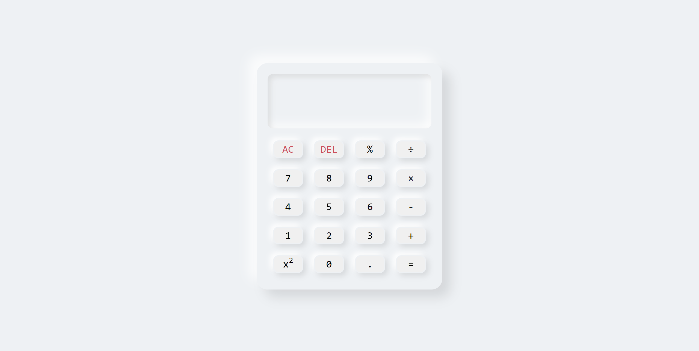

# Calculator Project

Here is a link to the live version of the project: [link](https://calculator-project-naresh.netlify.app/)

## Description
Developing a Calculator after gaining a basic understanding of HTML, CSS, and JavaScript offers an excellent opportunity to grasp core concepts and apply them to create a useful application. In this project, I will build a Calculator that can be customized to perform both simple and complex calculations according to individual needs.

The Calculator will incorporate essential arithmetic operations, including addition (+), subtraction (-), multiplication (*), and division (/). To expand its functionality, it will also support the modulo operation (%), allowing users to calculate remainders. Furthermore, the Calculator will enable users to find the square of a number, enhancing its versatility.

To enhance user experience and facilitate efficient calculations, the Calculator will include two additional key features. Firstly, an "All Clear" (AC) button will be implemented, enabling users to clear the current text and start fresh. Secondly, an "Equal" key will be provided to perform the desired operation.

The Calculator will be designed to handle both decimal and whole numbers, ensuring that users can perform calculations accurately and precisely, regardless of the number type involved. This flexibility will enable users to tackle a wide range of mathematical tasks using a single application.

## preview of the project

## technologies used
- HTML
- CSS
- JavaScript
